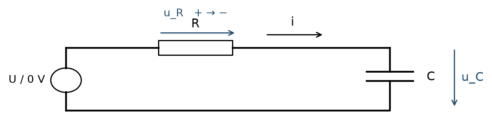
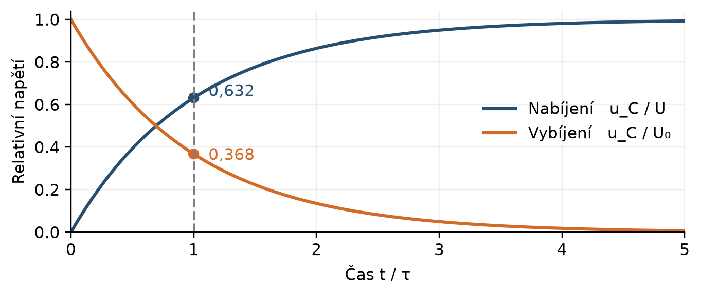
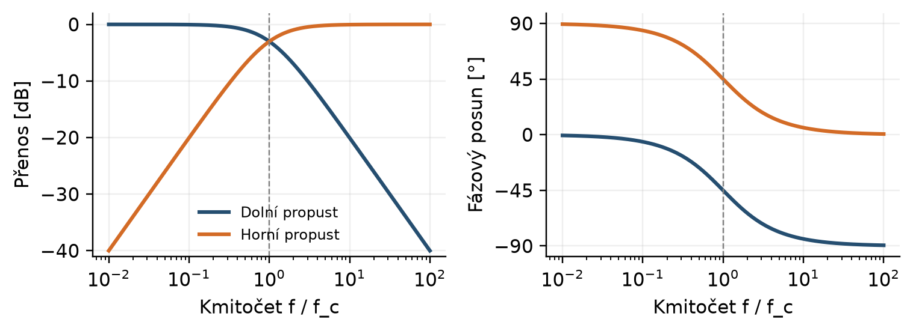
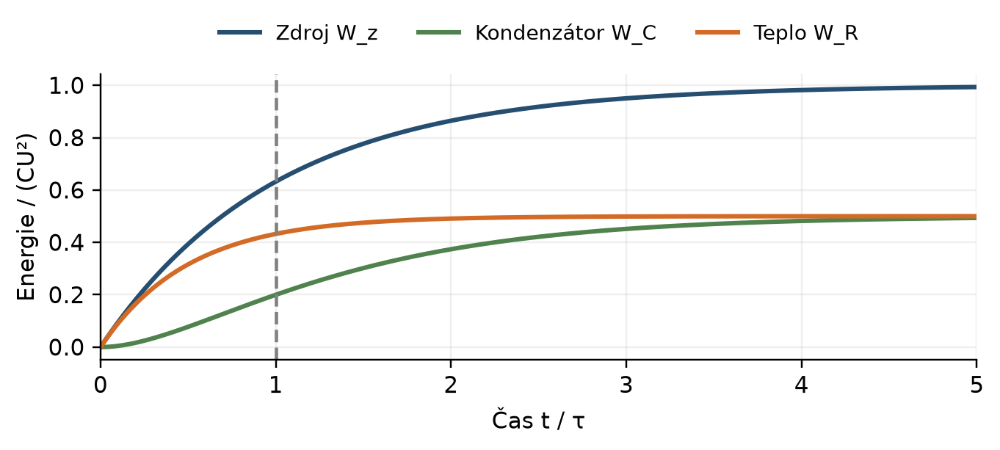
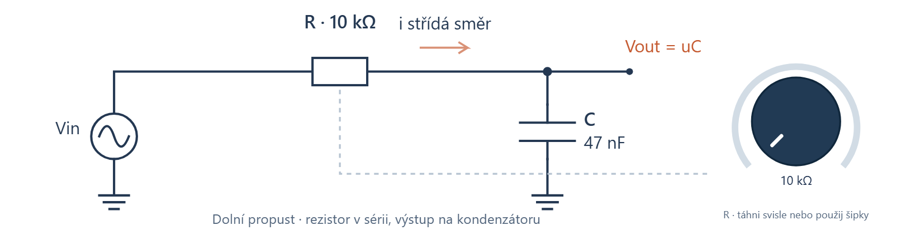
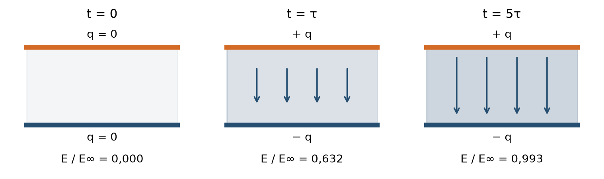

# Nabíjení a vybíjení kondenzátoru a RC obvody v hudbě

Matěj Teplý · UTB ve Zlíně · Fakulta aplikované informatiky

Zápočtový projekt č. 8 · AK3EJ Elektromagnetické jevy v informatice · 2026

[Interaktivní simulace](https://majkey25.github.io/rc-audio-lab/) · [Word](Zapoctovy_projekt_RC_obvody_v_hudbe.docx)

## Obsah

- [Značení](#značení)
- [Úvod](#úvod)
- [Kondenzátor a energie elektrického pole](#kondenzátor-a-energie-elektrického-pole)
- [Nabíjení a vybíjení RC obvodu](#nabíjení-a-vybíjení-rc-obvodu)
- [Časová konstanta a doba náběhu](#časová-konstanta-a-doba-náběhu)
- [RC filtry pro střídavé signály](#rc-filtry-pro-střídavé-signály)
- [Úkoly 1 a 2: napětí na rezistoru a kondenzátoru](#úkoly-1-a-2-napětí-na-rezistoru-a-kondenzátoru)
- [Úkol 3: energie přeměněná na teplo](#úkol-3-energie-přeměněná-na-teplo)
- [Filtrace zvuku kytary a baskytary](#filtrace-zvuku-kytary-a-baskytary)
- [Vazební kondenzátor a přenos basů](#vazební-kondenzátor-a-přenos-basů)
- [Bicí a časové řízení signálu](#bicí-a-časové-řízení-signálu)
- [Elektrické pole a kontrola modelu](#elektrické-pole-a-kontrola-modelu)
- [Interaktivní simulace k zápočtovému projektu](#interaktivní-simulace-k-zápočtovému-projektu)
- [Závěr](#závěr)
- [Použití nástrojů umělé inteligence](#použití-nástrojů-umělé-inteligence)
- [Seznam použité literatury](#seznam-použité-literatury)

# Značení

R odpor \[Ω\]; C kapacita \[F\]; U konstantní napětí zdroje \[V\]; u<sub>C</sub>, u<sub>R</sub> okamžitá napětí \[V\]; i proud \[A\]; τ časová konstanta \[s\]; f kmitočet \[Hz\]; H komplexní napěťový přenos; W energie \[J\]. Dolní propust je označena DP, horní propust HP. Desetinná čárka se používá v textu a tabulkách.

# Úvod

Tento zápočtový projekt řeší nabíjení a vybíjení kondenzátoru v RC obvodu a jeho použití jako jednoduchého filtru. Vychází ze zadání projektu č. 8 v předmětu AK3EJ Elektromagnetické jevy v informatice. Povinné jsou tři výsledky: vztahy pro napětí na rezistoru a kondenzátoru, napětí kondenzátoru v čase jedné časové konstanty a energie přeměněná na teplo do stejného okamžiku. \[1\]

Téma propojuji s hudbou, protože hraji na kytaru, baskytaru a bicí. Na nástrojích i efektech mě zajímá, co se vlastně v obvodu děje, když se mění barva zvuku. Rezistor s kondenzátorem je na to dobrý příklad. Tytéž dvě součástky určují časový průběh napětí i to, jak obvod propustí jednotlivé kmitočty.

Vedle výpočtů jsem k práci napsal interaktivní simulaci. Díky ní si můžu rovnice porovnat s grafy a rovnou slyšet, co filtr udělá se známým hudebním materiálem. Ukazuje přechodové děje i model vazebního kondenzátoru mezi zesilovacími stupni. Ve zvukové části přepínám mezi původní a filtrovanou kytarovou ukázkou a měním parametry za chodu. \[2\]

Všechny výpočty stojí na ideálních součástkách a čísla zvolená nad rámec zadání označuji jako modelová. Simulace a automatické testy ověřují výpočet, ne chování konkrétního pedálu nebo nástroje. Měření na reálném obvodu jsem neprováděl.

# Kondenzátor a energie elektrického pole

Kondenzátor tvoří dvě vodivé elektrody oddělené izolantem. Při nabíjení se na jedné hromadí kladný náboj a na druhé stejně velký záporný náboj. Mezi elektrodami vzniká elektrické pole. Kapacita C říká, kolik náboje q připadne na jeden volt napětí u<sub>C</sub>. U lineárního kondenzátoru je tento poměr stálý, takže platí q = Cu<sub>C</sub>. Jednotkou je farad, tedy coulomb na volt. \[3, kap. 5.1–5.2\]

```math
q\  = \ C\ u_{C}\ \ \ \ \ ;\ \ \ \ \ C\  = \ \varepsilon_{0}\varepsilon_{r}\left( \frac{S}{d} \right)\ \ \ \ ;\ \ \ \ \ E\  \approx \frac{u_{C}}{d}
```

U deskového kondenzátoru je S plocha jedné elektrody, d jejich vzdálenost, ε₀ permitivita vakua a ε<sub>r</sub> relativní permitivita dielektrika. Vzorec počítá s homogenním materiálem a zanedbává okraje desek. Větší plocha nebo menší mezera znamená větší kapacitu. Intenzita E má jednotku V/m a udává sílu působící na jednotkový kladný náboj.

## Uložení energie

Přenesení malého náboje dq mezi elektrodami vyžaduje práci dW = u<sub>C</sub> dq. Napětí přitom roste, takže celkovou práci nespočítáme jako konečné napětí krát konečný náboj. Integrujeme okamžitou hodnotu q/C a získáme energii elektrického pole. \[3, kap. 5.4\]

```math
W_{C}\  = \ \int_{0}^{q}{\left( \frac{q'}{C} \right)dq'} = \frac{q^{2}}{2C} = \ \frac{1}{2}\ C\ u_{C}^{2}
```

```math
w_{e} = \ \frac{1}{2}\ \varepsilon_{0}\varepsilon_{r}\ E^{2}
```

Veličina w<sub>e</sub> je objemová hustota energie v J/m³. Při dvojnásobném napětí vzroste energie čtyřikrát. Kondenzátor může uloženou energii vrátit do obvodu. Na rezistoru se mění na teplo, které se v tomto RC obvodu zpět na elektrickou energii nepřemění.

## Ideální model a skutečná součástka

Dielektrikum určuje kapacitu i to, jaké namáhání součástka snese. Při překročení jeho elektrické pevnosti nastane průraz. Kondenzátor se proto nevybírá jen podle kapacity. Stejně důležité je jmenovité napětí, tolerance a u elektrolytických typů i polarita. Fóliové kondenzátory bývají nepolarizované. \[3, kap. 5.5; 4, s. 1–2\]

Skutečná součástka má navíc ztráty, svod a parazitní indukčnost. Ve výpočtech je zanedbávám a pracuji s ideálním C a samostatným rezistorem R. Model tím zůstane přehledný a ukáže čistý RC děj. Jak dobře odpovídá realitě, záleží na pracovním kmitočtu, napětí a na tom, jakou chybu si můžeme dovolit.

# Nabíjení a vybíjení RC obvodu

Sériově spojíme ideální zdroj stálého napětí U, rezistor R \> 0 a vybitý kondenzátor C \> 0. V čase t = 0 obvod sepneme. Proud i bereme jako kladný ve směru nabíjení kladné elektrody. Napětí u<sub>R</sub> je úbytek v tomto směru, u<sub>C</sub> měříme od kladné elektrody k záporné. \[5, kap. 7.6\]



Obrázek 1 Sériový RC obvod a orientace veličin. Zdroj lze nastavit na U pro nabíjení nebo na 0 V pro vybíjení. Vlastní schéma.


## Diferenciální rovnice

Druhý Kirchhoffův zákon dává U = u<sub>R</sub> + u<sub>C</sub>. Z Ohmova zákona je u<sub>R</sub> = Ri. Definice proudu i = dq/dt spolu se vztahem q = Cu<sub>C</sub> vede na i = C du<sub>C</sub>/dt. Dosazením vznikne rovnice prvního řádu:

```math
RC\frac{du_{C}}{dt} + \ u_{C}\  = \ U\ \ \ \ \ ;\ \ \ \ \ u_{C}(0) = \ 0
```

Proměnné oddělíme na tvar du<sub>C</sub>/(U − u<sub>C</sub>) = dt/(RC). Integrujeme od počátečního stavu k okamžitému, takže meze nahradí integrační konstantu, a vyjde ln\[U/(U − u<sub>C</sub>)\] = t/(RC). Odlogaritmováním dostaneme průběhy napětí i proudu: \[5, kap. 7.6.1\]

```math
u_{C}(t) = \ U\left( 1\  - \ e^{- \frac{t}{RC}} \right)\ \ \ \ ;\ \ \ \ \ u_{R}(t) = \ Ue^{- \frac{t}{RC}}
```

```math
i(t) = \ \left( \frac{U}{R} \right)e^{- \frac{t}{RC}}
```

Hned po sepnutí je napětí vybitého kondenzátoru nulové, celé napětí zdroje leží na rezistoru a teče proud U/R. Jak se kondenzátor nabíjí, jeho napětí roste a proud klesá k nule. Skok napětí na kondenzátoru možný není, vyžádal by si nekonečný proudový impulz.

## Vybíjení a počáteční napětí

Při vybíjení nahradíme zdroj zkratem a orientace veličin necháme beze změny. Pravá strana rovnice se vynuluje. Pro počáteční napětí U₀ platí: \[5, kap. 7.6.2\]

```math
u_{C}(t) = \ U_{0}e^{- \frac{t}{RC}}\ \ \ \ ;\ \ \ \ \ i(t) = \  - \left( \frac{U_{0}}{R} \right)e^{- \frac{t}{RC}}
```

Napětí rezistoru je u<sub>R</sub> = Ri = −u<sub>C</sub>. Znaménko mínus jen říká, že proud teče opačně než při nabíjení. Oba děje popisuje jediný vztah u<sub>C</sub>(t) = U<sub>∞</sub> + \[u<sub>C</sub>(0) − U<sub>∞</sub>\]e<sup>−t/RC</sup>, kde U<sub>∞</sub> je nová ustálená hodnota napětí.

# Časová konstanta a doba náběhu

Časová konstanta τ = RC má jednotku sekunda, protože Ω·F = (V/A)·(A·s/V) = s. Po jedné časové konstantě zbývá e⁻¹ ≈ 36,8 % původního rozdílu mezi okamžitým a konečným napětím. Kondenzátor nabíjený z nuly proto dosáhne přibližně 63,2 % napětí zdroje. \[5, kap. 7.6; 4, s. 2–4\]



Obrázek 2 Nabíjení a vybíjení v závislosti na t/τ. Vlastní výpočet podle vztahů v kapitole 2.


| **Čas** | **Nabíjení u_C/U** | **Vybíjení u_C/U₀** |
|:-------:|:------------------:|:-------------------:|
|   0τ    |       0,00 %       |      100,00 %       |
|   1τ    |      63,21 %       |       36,79 %       |
|   2τ    |      86,47 %       |       13,53 %       |
|   5τ    |      99,33 %       |       0,67 %        |

Ani po pěti časových konstantách není kondenzátor matematicky plně nabitý. Zbývá odchylka e⁻⁵ ≈ 0,674 %. Za ustálený můžeme děj prohlásit ve chvíli, kdy je tato odchylka menší než přesnost, se kterou pracujeme. Větší R nebo C celý průběh zpomalí. Stejný součin RC ale nezaručí stejný proud ani energii, protože proud řídí odpor a energii kapacita.

## Náběh mezi deseti a devadesáti procenty

Pro dosažení podílu α napětí zdroje platí t<sub>α</sub> = −τ ln(1 − α). Cesta z nuly na 90 % trvá τ ln 10 ≈ 2,303τ. Doba mezi 10 % a 90 % je oproti tomu t₁₀–₉₀ = τ ln 9 ≈ 2,197τ. Rozdíl dělá jen to, od kterého bodu čas měříme.

U obdélníkového buzení rozhoduje délka půlperiody. Když je mnohem delší než τ, napětí na kondenzátoru se v každém úseku téměř ustálí. Při rychlém střídání se kondenzátor nestihne výrazně nabít ani vybít a napětí se vyhlazuje. Pokud pro sledované složky platí ωRC ≫ 1, lze dolní propust přibližně popsat jako integrátor. \[4, s. 3–6\]

Stejná konstanta určuje mezní kmitočet f<sub>c</sub> = 1/(2πτ). Součin t₁₀–₉₀f<sub>c</sub> vychází přibližně 0,350. Snížení mezního kmitočtu tedy prodlouží dobu náběhu.

# RC filtry pro střídavé signály

Harmonické napětí má tvar u<sub>in</sub>(t) = Û sin(ωt), kde Û je amplituda a ω = 2πf úhlový kmitočet. V ustáleném stavu počítáme s impedancemi Z<sub>R</sub> = R a Z<sub>C</sub> = 1/(jωC), přičemž j² = −1. Reaktance 1/(ωC) s rostoucím kmitočtem klesá, takže kondenzátor propouští vyšší kmitočty snáz. \[6, kap. 12.2\]

## Přenos a fáze

Výstup na kondenzátoru dává dolní propust, výstup na rezistoru horní propust. Vztahy níže počítají s ideálním zdrojem a nezatíženým výstupem. Přenos H je komplexní poměr výstupního a vstupního napětí. \[4, s. 5–6; 7, s. 5\]

```math
H_{DP}(j\omega) = \frac{1}{1\  + \ j\omega RC}\ \ \ \ ;\ \ \ \ \ H_{HP}(j\omega) = \frac{j\omega RC}{1\  + \ j\omega RC}
```

```math
\left| H_{DP} \right| = \frac{1}{\sqrt{1\  + \ (\omega RC)^{2}}}\ \ \ \ ;\ \ \ \ \ \left| H_{HP} \right| = \frac{\omega RC}{\sqrt{1\  + \ (\omega RC)^{2}}}
```

```math
\varphi_{DP} = \  - \arctan(\omega RC)\ \ \ \ ;\ \ \ \ \ \varphi_{HP} = \ 90{^\circ}\  - \arctan(\omega RC)
```

Při f<sub>c</sub> = 1/(2πRC) platí ωRC = 1. Obě propusti mají \|H\| = 1/√2 a zisk 20 log₁₀\|H\| ≈ −3,01 dB. Výstupní amplituda je tedy přibližně 70,7 % vstupní, nikoli 50 %. Na stejném odporu tomuto poměru napětí odpovídá poloviční výkon. Fáze je −45° u dolní a +45° u horní propusti.


Obrázek 3 Amplitudová a fázová charakteristika obou RC propustí. Vlastní výpočet, kmitočet je dělen mezním kmitočtem.


Hluboko nad f<sub>c</sub> klesá přenos dolní propusti o 20 dB na dekádu. Hluboko pod f<sub>c</sub> roste přenos horní propusti směrem k vyšším kmitočtům o týchž 20 dB na dekádu. To je asi 6 dB na oktávu. Přechod není ostrý, takže jednoduchý RC článek dělí pásma pozvolna.

Kladná fáze značí předstih ustálené sinusovky v rámci cyklu. Při nulovém kmitočtu je výstup horní propusti nulový a jeho fáze není definována.

# Úkoly 1 a 2: napětí na rezistoru a kondenzátoru

Zadání požaduje vztahy pro u<sub>R</sub> a u<sub>C</sub> a napětí kondenzátoru v čase τ. Konkrétní hodnoty součástek ani počáteční napětí v něm nejsou. Řeším proto nabíjení vybitého kondenzátoru ze stálého napětí U a vybíjení doplňuji zvlášť. \[1\]

## Úkol 1: obecné vztahy

Řešením rovnice RC du<sub>C</sub>/dt + u<sub>C</sub> = U s podmínkou u<sub>C</sub>(0) = 0 dostáváme:

```math
u_{C}(t) = \ U\left( 1\  - \ e^{- \frac{t}{\tau}} \right)\ \ \ \ ;\ \ \ \ \ u_{R}(t) = \ Ue^{- \frac{t}{\tau}}\ \ \ \ ;\ \ \ \ \ \tau\  = \ RC
```

Kontrola druhým Kirchhoffovým zákonem dává u<sub>R</sub>(t) + u<sub>C</sub>(t) = U pro libovolné t ≥ 0. Na začátku je celé napětí na rezistoru. V limitě t → ∞ je na kondenzátoru U a na rezistoru nula. Při vybíjení z napětí U platí u<sub>C</sub>(t) = Ue<sup>−t/τ</sup> a u<sub>R</sub>(t) = −Ue<sup>−t/τ</sup>, pokud orientaci měření nezměníme. \[5, kap. 7.6\]

## Úkol 2: dosazení času τ

V čase t = τ = RC se exponent zjednoduší na −1:

```math
u_{C}(\tau) = \ U\left( 1\  - \ e^{- 1} \right) \approx \ 0,632121\ U
```

Při vybíjení ze stejného počátečního napětí vyjde u<sub>C</sub>(τ) = Ue⁻¹ ≈ 0,367879U. Hodnoty 63,2 % a 36,8 % tedy patří dvěma různým dějům a rozlišuje je počáteční podmínka.

## Číselný příklad

Pro názornost dosadím U = 5,00 V, R = 10,0 kΩ a C = 1,00 µF. Jsou to modelové hodnoty, zadání je nepředepisuje. Časová konstanta vychází τ = 10,0 ms a počáteční nabíjecí proud 0,500 mA.

| **Veličina v čase τ** | **Nabíjení** | **Vybíjení** |
|:---------------------:|:------------:|:------------:|
|          u_C          |  3,16060 V   |  1,83940 V   |
|          u_R          |  1,83940 V   |  −1,83940 V  |
|           i           |  0,18394 mA  | −0,18394 mA  |

Součet napětí při nabíjení sedí: 3,16060 V + 1,83940 V = 5,00000 V. Proud si lze nezávisle ověřit z podílu u<sub>R</sub>/R. Záporný proud při vybíjení znamená obrácený směr toku náboje.

Kdyby na kondenzátoru zbylo počáteční napětí 2,00 V, dalo by obecné řešení u<sub>C</sub>(τ) = 5 + (2 − 5)e⁻¹ ≈ 3,896 V. Hodnota 0,632U tedy platí jen pro původně vybitý kondenzátor. U opakovaných impulzů je třeba počáteční napětí převzít z konce předchozího úseku.

# Úkol 3: energie přeměněná na teplo

Třetí úkol požaduje energii přeměněnou na teplo od sepnutí do času τ. Spočítáme ji integrací výkonu na rezistoru přes tento časový interval. Pro nabíjení z nuly použijeme proud odvozený v kapitole 2. \[1; 5, kap. 7.6\]

```math
p_{R}(t) = \ Ri^{2}(t) = \ \left( \frac{U^{2}}{R} \right)e^{- \frac{2t}{\tau}}
```

```math
W_{R}(t) = \ \int_{0}^{t}{p_{R}(s)ds} = \ \left( \frac{CU^{2}}{2} \right)\left( 1\  - \ e^{- \frac{2t}{\tau}} \right)
```

Dvojka v exponentu vzniká umocněním proudu. Integrace exponenciály pak přinese faktor τ/2 = RC/2. Po dosazení požadovaného času vychází:

```math
W_{R}(\tau) = \ \left( \frac{CU^{2}}{2} \right)\left( 1\  - \ e^{- 2} \right) \approx \ 0,432332\ CU^{2}
```

Součin F·V² dává joule. Při pevně zadaném čase t na odporu záleží, protože R je součástí exponentu. Měříme-li čas v násobcích RC, odpor se z koeficientu vykrátí.

## Energetická bilance

Práci zdroje spočítáme integrací Ui(t), energii kondenzátoru z okamžitého napětí. \[3, kap. 5.4\]

```math
W_{z}(t) = \ CU^{2}\left( 1\  - \ e^{- \frac{t}{\tau}} \right)\ \ \ \ ;\ \ \ \ \ W_{C}(t) = \ \frac{1}{2}CU^{2}\left( 1\  - \ e^{- \frac{t}{\tau}} \right)^{2}
```

Po úpravě je součet W<sub>C</sub> + W<sub>R</sub> přesně roven W<sub>z</sub>. V čase τ vychází koeficient 0,1997882 pro energii pole, 0,4323324 pro teplo a 0,6321206 pro zdroj. Bilance sedí ještě před zaokrouhlením.


Obrázek 4 Rozdělení energie během nabíjení. Svislá osa udává energii dělenou CU². Vlastní výpočet.


V číselném příkladu je CU² = 25,0 µJ. Teplo do τ činí 10,808 µJ, uložená energie 4,995 µJ a práce zdroje 15,803 µJ.

# Filtrace zvuku kytary a baskytary

Barvu tónu určuje poměr základní složky a vyšších harmonických i to, jak se v čase mění. Dolní propust zeslabuje vyšší složky, takže umí zmírnit ostrost trsátka. Horní propust naopak ubere ze spodku spektra. Oba účinky popíšeme přenosem jednotlivých harmonických, i když signál nástroje zdaleka není čistá sinusovka.

## Pasivní tónová clona

Pasivní tónová clona je kondenzátor a proměnný odpor. Fender dodává do tónových obvodů svých kytar a baskytar kondenzátor 0,05 µF. \[8\]

Magnetický snímač má ale i odpor vinutí, indukčnost a vlastní kapacitu. K tomu se přidá kabel, potenciometry a vstup zesilovače. Celek proto může mít rezonanční vrchol a stažení clony mění jeho polohu i tlumení. Z jmenovitých hodnot potenciometru a tónového kondenzátoru se charakteristika celého nástroje spočítat nedá. \[9\]

Vzorec f<sub>c</sub> = 1/(2πRC) tedy na pasivní snímač jako celek nesedí. V této práci s ním popisuji jednoduchý filtr za zdrojem s malým výstupním odporem. Úplný model snímače by musel zahrnout indukčnost L a jeho zatížení. \[6, kap. 12.3\]

## Samostatná dolní propust v efektovém řetězci

Vezměme R = 10,0 kΩ a C = 10,0 nF za oddělovacím zesilovačem. Odpor zdroje zanedbáme a další stupeň má vstupní odpor mnohem větší než R. Potom je τ = 100 µs a f<sub>c</sub> ≈ 1,59 kHz. Přenos vybraných kmitočtů vychází takto:

| **Kmitočet** | **Amplitudový přenos** | **Zisk**  |
|:------------:|:----------------------:|:---------:|
|    100 Hz    |         0,998          | -0,02 dB  |
|   1000 Hz    |         0,847          | -1,45 dB  |
|  1591,55 Hz  |         0,707          | -3,01 dB  |
|   5000 Hz    |         0,303          | -10,36 dB |

Složka 5 kHz projde zhruba s 30 % vstupní amplitudy, 100 Hz téměř beze změny. Mění se poměr harmonických, ladění struny zůstává. Při toleranci C ±10 % a přesném R leží mezní kmitočet mezi 1,45 a 1,77 kHz. Tolerance se projeví v charakteristice; slyšitelnost rozdílu závisí také na signálu a poslechu.

# Vazební kondenzátor a přenos basů

Vazební kondenzátor v sérii se signálem odděluje stejnosměrná pracovní napětí sousedních stupňů. Se vstupním odporem dalšího stupně tvoří horní propust. Při nízkém kmitočtu má velkou reaktanci, takže si na sebe vezme větší část napětí. Na zátěž zbude méně signálu. \[4, s. 5–6; 10\]

## Vliv odporu zdroje a zátěže

Označme odpor zdroje R<sub>s</sub> a vstupní odpor dalšího stupně R<sub>L</sub>. Napěťový dělič z impedancí dá přenos:

```math
H(j\omega) = \frac{j\omega C\ R_{L}}{1\  + \ j\omega C\left( R_{s} + \ R_{L} \right)}
```

```math
f_{c}\  = \frac{1}{\left\lbrack 2\pi C\left( R_{s} + \ R_{L} \right) \right\rbrack}\ \ \ ;\ \ \ \ \ \left| H(\infty) \right| = \frac{R_{L}}{R_{s} + \ R_{L}}
```

Při R<sub>s</sub> ≪ R<sub>L</sub> odpor zdroje zanedbáme. Jinak srazí přenos v propustném pásmu a posune časovou konstantu. Nižší kmitočet pólu pak sám o sobě neznamená větší výstupní napětí.

## Volba kapacity pro baskytaru

Pro porovnání zvolíme R<sub>L</sub> = 100 kΩ a zanedbatelné R<sub>s</sub>. Kapacita 100 nF dává f<sub>c</sub> ≈ 15,9 Hz, kapacita 10 nF mez přibližně 159 Hz. Tóny E₁ a H₀ mají při ladění A₄ = 440 Hz kmitočet přibližně 41,2 a 30,9 Hz.

| **Kmitočet** | **100 nF, f_c = 15,9 Hz** | **10 nF, f_c = 159 Hz** |
|:------------:|:-------------------------:|:-----------------------:|
|   30,9 Hz    |         -1,02 dB          |        -14,40 dB        |
|   41,2 Hz    |         -0,60 dB          |        -12,02 dB        |
|    100 Hz    |         -0,11 dB          |        -5,48 dB         |
|   1000 Hz    |         -0,00 dB          |        -0,11 dB         |

Zmenšení C na desetinu zvětší útlum základní složky E₁ z 0,60 dB na 12,02 dB. U H₀ stoupne z 1,02 dB na 14,40 dB. Vyšší harmonické se zeslabují méně, a tak se mění jejich poměr k základnímu tónu. Výsledek popisuje zvolený RC model, nikoli měření konkrétní baskytary.

V kytarovém řetězci bývá takové omezení basů před zkreslujícím stupněm záměrné. Mění, které složky ten stupeň budí, a tím i charakter zkreslení. Samotná horní propust je ovšem lineární, takže zkreslení zesilovače nijak nemodeluje.

Při zapnutí může vazební kondenzátor přenést změnu stejnosměrné úrovně jako krátký impulz. Pro ideální zdroj a zátěž R<sub>L</sub> je odezva u<sub>out</sub> = Ue<sup>−t/τ</sup>, kde τ = R<sub>L</sub>C. Kondenzátor tedy potlačuje ustálenou stejnosměrnou složku, přechodový děj ale neodstraní okamžitě.

# Bicí a časové řízení signálu

U bicích rozhoduje nástup úderu a to, jak rychle pak amplituda klesá. RC článek najdeme v obálkovém detektoru i v generátoru obálky. Napětí na kondenzátoru tam řídí zesílení nebo filtraci. Se zvukovou vlnou bubnu totožné není.

## Detekce obálky

Jednoduchý detektor má usměrňovač a kondenzátor s vybíjecí cestou. Jakmile vstupní napětí převýší napětí kondenzátoru zvětšené o úbytek na diodě, kondenzátor se nabíjí. Po poklesu vstupu se dioda zavře a náboj odtéká přes odpor. Nabíjení a vybíjení proto mohou mít docela jiné časy. Pouhá dolní propust připojená k symetrickému zvukovému signálu kladnou obálku nevytvoří. \[11, část Peak Detector\]

Pro výpočet použijeme idealizovaný řídicí impulz o výšce 1 V a délce 50 ms. Zvolíme C = 1 µF, nabíjecí cestu R<sub>A</sub> = 10 kΩ a vybíjecí cestu R<sub>R</sub> = 100 kΩ. Konstanty jsou τ<sub>A</sub> = 10 ms a τ<sub>R</sub> = 100 ms. Úbytek na diodě zanedbáme a předpokládáme ideální přepínání cest.

```math
u_{env}(t) = \ 1\ V\  \cdot \ \left( 1\  - \ e^{- \frac{t}{\tau_{A}}} \right)\ \ \ \ \ \ \ \ \ \ \ \ \ 0\  \leq \ t\  < \ 50\ ms
```

```math
u_{env}(t) = \ u_{env}(50\ ms)e^{- \frac{t\  - \ 50\ ms}{\tau_{R}}}\ \ \ \ t\  \geq \ 50\ ms
```



Obrázek 5 Modelová obálka s rychlejším nabíjením a pomalejším vybíjením. Vlastní výpočet, nikoli záznam bubnu.


Po 10 ms je napětí 0,632 V, na konci impulzu 0,993 V. Za dalších 100 ms klesne na 0,366 V. Pokles na desetinu hodnoty z konce impulzu trvá přibližně 230 ms.

## Význam pro kompresi

Krátká reakce detektoru umožní kompresoru zasáhnout do začátku úderu. Delší reakce může část špičky propustit. Analog Devices tento rozdíl popisuje na příkladu malého bubnu. Parametry attack, hold a release závisejí na konstrukci a způsobu měření, proto je nelze automaticky ztotožnit s jedinou konstantou RC. \[12\]

Příliš rychlé sledování může zvlnit řídicí napětí. Pomalý pokles je zase může udržet zvýšené až do dalšího úderu. Vhodné časy proto závisejí na zpracovávaném signálu.

# Elektrické pole a kontrola modelu

Vztah E(t) ≈ u<sub>C</sub>(t)/d převádí obvodové napětí na děj mezi elektrodami. Při neměnné geometrii kopíruje intenzita pole průběh napětí. Při nabíjení se blíží konečné hodnotě, při vybíjení klesá. Obrázek níže používá homogenní deskový model bez okrajových jevů. \[3, kap. 5.2 a 5.4\]



Obrázek 6 Relativní intenzita elektrického pole při nabíjení. Směr šipek míří od kladné elektrody k záporné. Vlastní schéma.


## Napětí a energie nerostou ve stejném poměru

Pro U = 5 V a d = 1 mm vychází konečná intenzita 5 000 V/m a v čase τ přibližně 3 161 V/m. Vzdálenost elektrod volím jen kvůli názornosti tohoto geometrického příkladu.

V čase τ dosahují napětí i intenzita 63,21 % konečné hodnoty. Energie závisí na druhé mocnině napětí, takže uloženo je (1 − e⁻¹)² ≈ 39,96 % konečné energie. Zbývajících přibližně 60 % se uloží později. Poměr energií tedy nelze zaměňovat s poměrem napětí. \[3, kap. 5.4\]

## Výpočetní kontrola

Odvozené řešení si ověřím dosazením zpět do rovnice, kontrolou počáteční podmínky a součtem napětí. U energie je nezávislou kontrolou numerická integrace i²R porovnaná s prací zdroje a energií kondenzátoru. Takové kontroly odhalí chybějící dvojku v exponentu i obrácené znaménko při vybíjení.

Pro U = 5 V, R = 10 kΩ a C = 1 µF jsem energii do τ spočítal analyticky i lichoběžníkovou integrací se 100 000 intervaly. Obě cesty daly 10,808309 µJ.

## Možné laboratorní ověření

Na nízkonapěťovém obvodu by stačilo přivést skok a osciloskopem odečíst čas, kdy napětí dosáhne 63,2 % změny. Přenos by se změřil sinusovým signálem s proměnným kmitočtem. Do výsledku by promluvil odpor generátoru i zatížení sondou. Měření jsem neprováděl, práce stojí na výpočtu.

# Interaktivní simulace k zápočtovému projektu

K této práci jsem si naprogramoval simulaci RC Audio Lab, abych odvozeným výpočtům lépe rozuměl. Propojuje je s hudební elektronikou, kterou znám z hraní na kytaru, baskytaru a bicí. Vedle grafů napětí, proudu a přenosu nabízí přehrávání zvuku zpracovaného filtrem. \[2\]



Obrázek 7 Ovládání vlastní simulace RC Audio Lab v režimu dolní propusti. Odpor lze měnit posuvníkem i otočným ovladačem u rezistoru. Snímek vlastní aplikace. [2]


## Dvě odbočky téhož obvodu

Odbočku výstupu lze přepnout. Na rezistoru vzniká horní propust, která modeluje vazební člen mezi zesilovacími stupni. Na kondenzátoru vzniká dolní propust pro omezení výšek za zdrojem s malým výstupním odporem. Pasivní kytarovou clonu se snímačem tento model plně nepopisuje, jak vysvětluje kapitola 7. Schéma při přepnutí prohodí polohu součástek, jejich hodnoty ale zůstanou stejné.

Výchozí horní propust má R = 10 kΩ, C = 1,38 nF a mezní kmitočet přibližně 11,5 kHz. Výrazně tlumí nahrávku pod tímto kmitočtem, takže rozdíl mezi přímým a filtrovaným zvukem je dobře patrný. Počáteční frekvence 306 Hz určuje sinusový signál a bod v grafu, nikoli frekvenci nahrávky. Dolní propust s R = 10 kΩ, C = 47 nF a mezním kmitočtem přibližně 339 Hz zůstává dostupná jako předvolba. Potlačuje značnou část vyšších harmonických. Automatický test této předvolby používá první tři sekundy původní nahrávky tónu F₂, ze které aplikace skládá riff. Původní i filtrovaný signál při stejném zesílení dále procházejí čtyřmi měřicími horními propustmi na 2 kHz. Ty zvýrazní výšky, pásmo ale neoddělují ostře. Střední kvadratická hodnota takto upraveného signálu klesla při kontrole přibližně o 16,4 dB. Výsledek se vztahuje k této nahrávce a tomuto postupu.

Zvuková ukázka stojí na nahrávce elektrické kytary z knihovny FreePats pod licencí CC0. Z jednoho tónu skládám krátký riff přeladěním jednotlivých not. Přepínač A/B drží stejné vstupní zesílení a R i C jdou měnit za chodu. \[13\]

## Odhad přenosu z běžícího zvuku

Zvuk zpracovává filtr prvního řádu v AudioWorkletu. Jeho koeficienty vzniknou bilineární transformací s přizpůsobením mezního kmitočtu. Pro dolní propust a ustálené parametry platí: \[14; 2\]

```math
y\lbrack n\rbrack = \ b_{0}x\lbrack n\rbrack + \ b_{1}x\lbrack n - 1\rbrack - \ a_{1}y\lbrack n - 1\rbrack
```

```math
b_{0} = \ b_{1} = \frac{k}{1\  + \ k}\ \ \ \ ;\ \ \ \ \ a_{1} = \frac{k\  - \ 1}{k\  + \ 1}\ \ \ \ ;\ \ \ \ \ k\  = \tan\left( \pi\frac{f_{c}}{f_{s}} \right)
```

U odbočky na rezistoru se mění jen čitatel, kde je b₀ = 1/(1 + k) a b₁ = −b₀. Vzorkovací kmitočet f<sub>s</sub> je 48 kHz.

Dva spektrální analyzátory sledují signál před filtrem a za ním. Rozdíl jejich úrovní v decibelech odhaduje amplitudový přenos. Pro tuto ukázku je vhodný bílý šum, protože budí celé sledované pásmo. U kytarového tónu se odhad zhoršuje tam, kde vstup obsahuje málo energie. Výsledek ovlivňuje také délka analyzovaného úseku a vyhlazování spekter.



Obrázek 8 Odhad přenosu ze vstupního a výstupního spektra vedle vypočtené charakteristiky. Snímek vlastní aplikace. [2]


V nižších kmitočtech se číslicový a analogový model téměř shodují. U zobrazené dolní propusti se blízko poloviny vzorkovacího kmitočtu rozcházejí kvůli nelineárnímu převodu kmitočtové osy při bilineární transformaci. Přizpůsobení zaručuje shodu na mezním kmitočtu, nikoli v celém pásmu. Přepnutí na nefiltrovaný zvuk má odhad přenosu vrátit k 0 dB. Takto lze ověřit, že ovladač mění zpracování signálu. Nejde o měření fyzického obvodu.

Simulace je dostupná na <https://majkey25.github.io/rc-audio-lab/>, zdrojový kód a dokumentace na <https://github.com/Majkey25/rc-audio-lab>. \[2\]

# Závěr

Pro nabíjení původně vybitého kondenzátoru platí u<sub>C</sub>(t) = U(1 − e<sup>−t/RC</sup>) a u<sub>R</sub>(t) = Ue<sup>−t/RC</sup>. Jejich součet je v každém okamžiku roven U. Po jedné časové konstantě τ = RC dosahuje napětí kondenzátoru 0,632121U. Při vybíjení ze stejného napětí na něm zbývá 0,367879U a proud teče opačně než při nabíjení.

Teplo na rezistoru do času τ je W<sub>R</sub>(τ) = ½CU²(1 − e⁻²), tedy přibližně 0,432332CU². Součet tepla a uložené energie odpovídá práci zdroje. Při úplném nabití napěťovým skokem se energie rozdělí na ½CU² v poli a ½CU² v teple, a to nezávisle na odporu. Platí to ale jen pro nabíjení skokem, ne pro každý způsob nabíjení. Při vybíjení z U je teplo do τ stejné, jen energii tentokrát dodává kondenzátor. Numerická integrace analytický výpočet potvrdila.

Vazební kondenzátor ukazuje praktický význam mezního kmitočtu. Při odporu 100 kΩ zvedne změna kapacity ze 100 nF na 10 nF mez z 15,9 Hz na 159 Hz. Základní složka basového tónu E₁ pak zeslábne přibližně o 12 dB namísto 0,60 dB. V časovacích obvodech tatáž konstanta RC řídí náběh a pokles řídicího napětí.

V simulaci si tyto vztahy projdu při změně parametrů a porovnám je s filtrovaným zvukem. Slouží k názornému vysvětlení části výpočtů. Pasivní snímač by vyžadoval také indukčnost a zatížení, kompresor navíc detektor a řízené zesílení. \[2\]

# Použití nástrojů umělé inteligence

Při přípravě tohoto projektu jsem využil nástroje generativní umělé inteligence jako moderní pracovní pomůcky pro psaní, výpočty a vývoj softwaru. Šlo o Antigravity, Codex a Claude Code. Pomáhaly při hledání zdrojů, návrhu a úpravě textu, vysvětlování vztahů, tvorbě grafů, programování simulace, kontrole kódu a sazbě dokumentu. Nešlo tedy jen o kontrolu pravopisu. \[15; 16; 17\]

Použité modely a nastavení uvádím podle pracovního záznamu: Gemini 3.8 Flash (high), GPT-6 Astra (high a medium), Fable 5.1 (high) a Opus 5 (xhigh). Názvy nechávám v podobě, ve které je nástroje hlásily. Označení režimu vyjadřuje nastavení daného běhu, nikoli samostatný odborný zdroj.

Za konečné znění projektu, za výpočty i za jejich výklad odpovídám jako autor. Fyzikální výklad opírám o uvedenou literaturu, kterou výstupy AI nenahrazují. Číselné hodnoty byly porovnány s analytickými vztahy, energetickou bilancí a automatickými testy. Nástroje uvádím podle doporučení knihovny UTB k deklaraci a citování AI. \[18; 19\]

Shrnutí zadaných úloh pro AI: vysvětlit RC děj a odvodit tři výsledky podle zadání, propojit téma s hudební elektronikou, vytvořit grafy a vysázet text do šablony UTB, naprogramovat česko-anglickou simulaci se zvukovým filtrem a zkontrolovat rovnice, kód, citace i čitelnost. Pozdější revize pak žádaly odstranit nepodložená tvrzení, odlišit výpočet od měření a opravit nalezené chyby.

# Seznam použité literatury

\[1\] AK3EJ. Podrobný popis projektů: projekt č. 8 Nabíjení a vybíjení kondenzátoru, děj RC. Studijní zadání dodané ve formátu CSV a v souboru Projekt8.docx. Bez data. Shrnutí zadání v dokumentaci projektu. Dostupné z: <https://github.com/Majkey25/rc-audio-lab/blob/main/docs/assignment.md>

\[2\] TEPLÝ, Matěj. RC Audio Lab: interaktivní simulace RC obvodů v hudební elektronice. Verze 1.0. 2026. Webová aplikace a zdrojový kód, repozitář Majkey25/rc-audio-lab. Online. \[cit. 2026-09-11\]. Dostupné z: <https://majkey25.github.io/rc-audio-lab/>

\[3\] MIT; ALDEBARAN GROUP FOR ASTROPHYSICS. Elektřina a magnetizmus V Kapacita a dielektrika. Český překlad Petr Kulhánek. Bez data. Kap. 5.1, 5.2 a 5.4. Dodaný soubor kurz_05_diel.pdf; online kurz. \[cit. 2026-09-11\]. Dostupné z: <https://www.aldebaran.cz/elmg/kurz_05_diel.pdf>

\[4\] BALES, James A. Lecture 4 RC Circuits. Practical Electronics, Fall 2004. MIT OpenCourseWare. 2004. S. 2–6. Online. \[cit. 2026-09-11\]. Dostupné z: <https://ocw.mit.edu/courses/ec-s06-practical-electronics-fall-2004/5d70e7c37b7dc19e1e947e7a7b1d4ac6_MITEC_S06F04_lec04.pdf>

\[5\] MIT; ALDEBARAN GROUP FOR ASTROPHYSICS. Elektřina a magnetizmus VII Stejnosměrné obvody. Český překlad Jan Pacák. Bez data. Kap. 7.4 a 7.6, s. 6–14. Dodaný soubor kurz_07_curd.pdf. \[cit. 2026-09-11\]. Dostupné z: <https://www.aldebaran.cz/elmg/kurz_07_curd.pdf>

\[6\] MIT; ALDEBARAN GROUP FOR ASTROPHYSICS. Elektřina a magnetizmus XII Střídavé obvody. Český překlad Jan Pacák. Bez data. Kap. 12.2–12.3, s. 2–11. Dodaný soubor kurz_12_cura.pdf. \[cit. 2026-09-11\]. Dostupné z: <https://www.aldebaran.cz/elmg/kurz_12_cura.pdf>

\[7\] MASSACHUSETTS INSTITUTE OF TECHNOLOGY. 6.117 Lecture 3 Digital circuits power supplies and regulation. IAP 2020. S. 5, Types of filters. Online. \[cit. 2026-09-11\]. Dostupné z: <https://web.mit.edu/6.117/www/lec3.pdf>

\[8\] FENDER MUSICAL INSTRUMENTS CORPORATION. Capacitor Ceramic Disc .05uF @ 100V 20% (12). Produktová dokumentace, části Overview a Features. Bez data. Online. \[cit. 2026-09-11\]. Dostupné z: <https://www.fender.com/products/capacitor-ceramic-disc-05uf-100v-20-percent-12>

\[9\] ORPHEO. 250k vs 500k pots: Going Deeper into the Subject. Seymour Duncan. Aktualizováno 28. 9. 2022. Část o rezonanci snímače a odporové a kapacitní zátěži. Online. \[cit. 2026-09-11\]. Dostupné z: <https://www.seymourduncan.com/blog/tips-and-tricks/250k-pots-versus-500k-pots-going-deeper-into-the-subject>

\[10\] TEXAS INSTRUMENTS. RC circuits. TI Precision Labs, výukové video o přechodovém a kmitočtovém chování RC obvodů. 31. 12. 2020. Online. \[cit. 2026-09-11\]. Dostupné z: <https://www.ti.com/video/6119035031001>

\[11\] ANALOG DEVICES. Chapter 7 Diode application topics. Část Peak Detector. Analog Devices University Program. Bez data. Online. \[cit. 2026-09-11\]. Dostupné z: <https://wiki.analog.com/university/courses/electronics/text/chapter-7>

\[12\] ANALOG DEVICES. An Overview of Automatic Level Control. 22. 12. 2005. Technický článek, část How Does ALC Work. Online. \[cit. 2026-09-11\]. Dostupné z: <https://www.analog.com/en/resources/technical-articles/an-overview-of-automatic-level-control.html>

\[13\] FREEPATS. Electric Guitar FSBS clean. Verze 2026-08-07. Zvuková knihovna, vzorek F2_s1_01.flac. Licence CC0 1.0. Online. \[cit. 2026-09-11\]. Dostupné z: <https://github.com/freepats/electric-guitar-FSBS-clean>

\[14\] W3C. Web Audio API. W3C Recommendation, 17. 6. 2021. Části AudioWorklet a AudioParam. Online. \[cit. 2026-09-11\]. Dostupné z: <https://www.w3.org/TR/2021/REC-webaudio-20210617/>

\[15\] GOOGLE. Antigravity. Vývojový nástroj využitý při přípravě projektu. Online. \[cit. 2026-09-11\]. Dostupné z: <https://antigravity.google/>

\[16\] OPENAI. Codex. Vývojový nástroj využitý při přípravě projektu. Online. \[cit. 2026-09-11\]. Dostupné z: <https://openai.com/codex/>

\[17\] ANTHROPIC. Claude Code overview. Dokumentace vývojového nástroje využitého při přípravě projektu. Online. \[cit. 2026-09-11\]. Dostupné z: <https://code.claude.com/docs/en/overview>

\[18\] UNIVERZITA TOMÁŠE BATI VE ZLÍNĚ, Knihovna. Prohlášení o používání nástrojů AI v práci. Informační výchova K.UTB. Bez data. Online. \[cit. 2026-09-11\]. Dostupné z: <https://iva.k.utb.cz/lekce/prohlaseni-o-pouzivani-nastroju-ai-v-praci/>

\[19\] UNIVERZITA TOMÁŠE BATI VE ZLÍNĚ, Knihovna. Citování při využívání nástrojů AI. Informační výchova K.UTB. Bez data. Online. \[cit. 2026-09-11\]. Dostupné z: <https://iva.k.utb.cz/lekce/citovani-pri-vyuzivani-nastroju-ai/>
