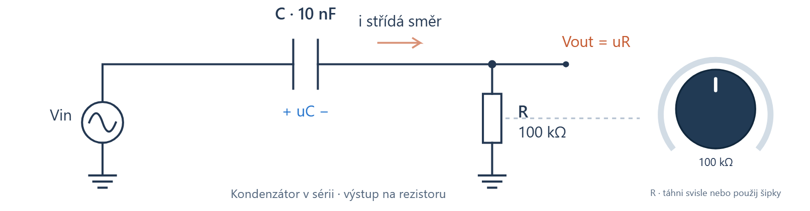

# Nabíjení a vybíjení kondenzátoru a RC obvody v hudbě

Matěj Teplý · UTB ve Zlíně · Fakulta aplikované informatiky

Zápočtový projekt č. 8 · AK3EJ Elektromagnetické jevy v informatice · 2026

[Interaktivní simulace](https://majkey25.github.io/rc-audio-lab/) · [Word](Zapoctovy_projekt_RC_obvody_v_hudbe.docx)

## Obsah

- [Značení](#značení)
- [Kondenzátor a energie elektrického pole](#kondenzátor-a-energie-elektrického-pole)
- [Nabíjení a vybíjení RC obvodu](#nabíjení-a-vybíjení-rc-obvodu)
- [Časová konstanta a doba náběhu](#časová-konstanta-a-doba-náběhu)
- [RC filtry pro střídavé signály](#rc-filtry-pro-střídavé-signály)
- [Úkoly 1 a 2 Napětí na rezistoru a kondenzátoru](#úkoly-1-a-2-napětí-na-rezistoru-a-kondenzátoru)
- [Úkol 3 Energie přeměněná na teplo](#úkol-3-energie-přeměněná-na-teplo)
- [Filtrace zvuku kytary a baskytary](#filtrace-zvuku-kytary-a-baskytary)
- [Vazební kondenzátor a přenos basů](#vazební-kondenzátor-a-přenos-basů)
- [Bicí a časové řízení signálu](#bicí-a-časové-řízení-signálu)
- [Elektrické pole a kontrola modelu](#elektrické-pole-a-kontrola-modelu)
- [Interaktivní simulace k zápočtovému projektu](#interaktivní-simulace-k-zápočtovému-projektu)

# Značení

R odpor \[Ω\]; C kapacita \[F\]; U konstantní napětí zdroje \[V\]; uC, uR okamžitá napětí \[V\]; i proud \[A\]; τ časová konstanta \[s\]; f kmitočet \[Hz\]; H komplexní napěťový přenos; W energie \[J\]. Dolní propust je označena DP, horní propust HP. Desetinná čárka se používá v textu a tabulkách.

Úvod

Tento zápočtový projekt řeší nabíjení a vybíjení kondenzátoru v RC obvodu a jeho použití jako jednoduchého filtru. Vychází ze zadání projektu č. 8 v předmětu AK3EJ Elektromagnetické jevy v informatice. Povinná část zahrnuje vztahy pro napětí na rezistoru a kondenzátoru, napětí kondenzátoru v čase jedné časové konstanty a energii přeměněnou na teplo do stejného okamžiku. \[1\]

Téma propojuji s hudbou, protože hraji na kytaru, baskytaru a bicí. U nástrojů a efektů mě zajímá, co se při úpravě barvy zvuku mění v obvodu. Kondenzátor s rezistorem nabízí konkrétní příklad: stejné součástky určují časový průběh napětí i přenos jednotlivých kmitočtů.

Vedle výpočtů jsem pro tuto práci vytvořil interaktivní simulaci. Pomáhá mi porovnat rovnice s grafy a s účinkem filtru na známý hudební materiál. Zobrazuje přechodové děje a model vazebního kondenzátoru mezi zesilovacími stupni. Část se zvukem umožňuje přepínat původní a filtrovanou kytarovou ukázku a měnit parametry během přehrávání. \[2\]

Výpočty vycházejí z ideálních součástek. Číselné hodnoty zvolené nad rámec zadání jsou označeny jako modelové. Výsledky simulace a automatických testů jsou výpočetní ověření; nepředstavuji je jako laboratorní měření skutečného kondenzátoru, pedálu nebo nástroje.

# Kondenzátor a energie elektrického pole

Kondenzátor tvoří dvě vodivé elektrody oddělené izolantem. Při nabíjení se na jedné elektrodě hromadí kladný náboj a na druhé záporný náboj stejné velikosti. Mezi elektrodami vzniká elektrické pole. Kapacita C vyjadřuje, jak velký náboj q připadá na jednotku napětí uC. Pro lineární kondenzátor platí q = Cu_C. Jednotkou kapacity je farad, tedy coulomb na volt. \[3, kap. 5.1–5.2\]

$`q\  = \ C\ u_{C}\ \ \ \ \ ;\ \ \ \ \ C\  = \ \varepsilon ₀\ \varepsilon_{r}(S/d)\ \ \ \ \ ;\ \ \ \ \ E\  \approx \ u_{C}/d`$

U deskového kondenzátoru označuje S plochu jedné elektrody, d vzdálenost elektrod, ε₀ permitivitu vakua a εr relativní permitivitu dielektrika. Vztah pro kapacitu předpokládá homogenní materiál a zanedbává okraje desek. Při větší ploše nebo menší vzdálenosti elektrod je kapacita větší. Elektrická intenzita E se udává ve V/m a popisuje sílu působící na jednotkový kladný náboj.

## Uložení energie

Přesunutí malého náboje dq mezi elektrodami vyžaduje práci dW = uC dq. Napětí během nabíjení roste, takže nelze celou práci spočítat jako konečné napětí násobené konečným nábojem. Je nutné integrovat průběžnou hodnotu q/C. Výsledkem je energie elektrického pole: \[3, kap. 5.4\]

$`W_{C}\  = \ \int ₀\hat{}q\ (q'/C)\ dq'\  = \ q²/(2C)\  = \ ½\ C\ u_{C}²`$

$`w\_ e\  = \ ½\ \varepsilon ₀\ \varepsilon_{r}\ E²`$

Veličina we je objemová hustota energie v J/m³. Při zdvojnásobení napětí na stejném kondenzátoru vzroste energie čtyřikrát. Ideální kondenzátor může uloženou energii vrátit do obvodu. Rezistor ji mění na teplo, které se tímto způsobem zpět na elektrickou energii nepřemění.

## Ideální model a skutečná součástka

Dielektrikum určuje kapacitu i dovolené elektrické namáhání. Překročení jeho elektrické pevnosti může vyvolat průraz. Proto při výběru součástky nestačí znát kapacitu, ale také jmenovité napětí, polaritu a toleranci. Fóliové kondenzátory bývají nepolarizované; elektrolytické typy zpravidla vyžadují určenou polaritu. \[3, kap. 5.5; 4, s. 1–2\]

Skutečný kondenzátor má ztráty, svod a parazitní indukčnost. V dalších výpočtech je zanedbávám a používám ideální C spolu s explicitním rezistorem R. Takový model umožňuje oddělit samotný RC děj od dalších vlastností součástky. Jeho přesnost se vždy posuzuje podle pracovního kmitočtu, napětí a požadované chyby.

# Nabíjení a vybíjení RC obvodu

Uvažujme ideální zdroj stálého napětí U, rezistor R \> 0 a kondenzátor C \> 0 v sérii. Zdroj připojíme v čase t = 0 k vybitému kondenzátoru. Proud i je kladný při nabíjení kladné elektrody. Napětí uR je úbytek ve směru i, napětí uC měříme od kladné elektrody k záporné. \[5, kap. 7.6\]

Obrázek 1 Sériový RC obvod a orientace veličin. Zdroj lze nastavit na U pro nabíjení nebo na 0 V pro vybíjení. Vlastní schéma.

## Diferenciální rovnice

Druhý Kirchhoffův zákon dává U = uR + uC. Z Ohmova zákona je uR = Ri. Definice proudu i = dq/dt a vztah q = Cu_C vedou k i = C du_C/dt. Dosazením získáme rovnici prvního řádu:

$`RC\ du_{C}/dt\  + \ u_{C}\  = \ U\ \ \ \ \ ;\ \ \ \ \ u_{C}(0)\  = \ 0`$

Proměnné oddělíme jako du_C/(U − uC) = dt/(RC). Integrací mezi počátečním a okamžitým stavem vznikne bezrozměrný logaritmus ln\[U/(U − uC)\] = t/(RC). Po úpravě dostáváme: \[5, kap. 7.6.1\]

$`u_{C}(t)\  = \ U(1\  - \ e\hat{}( - t/RC))\ \ \ \ \ ;\ \ \ \ \ u_{R}(t)\  = \ Ue\hat{}( - t/RC)`$

$`i(t)\  = \ (U/R)e\hat{}( - t/RC)`$

Na začátku je uC = 0 a i = U/R. Jak kondenzátor získává náboj, jeho napětí roste a proud klesá. Pro t → ∞ se uC blíží U a proud nule. Při konečném proudu se napětí kondenzátoru mění spojitě; jeho skok by vyžadoval proudový impulz.

## Vybíjení a počáteční napětí

Při vybíjení nahradíme zdroj zkratem a zachováme orientace veličin. Pravá strana diferenciální rovnice je nulová. Pro počáteční napětí U₀ platí: \[5, kap. 7.6.2\]

$`u_{C}(t)\  = \ U₀e\hat{}( - t/RC)\ \ \ \ \ ;\ \ \ \ \ i(t)\  = \  - (U₀/R)e\hat{}( - t/RC)`$

Napětí rezistoru je uR = Ri = −uC. Záporný proud označuje obrácený směr, nikoli chybu ve výpočtu. Oba děje sjednocuje vztah uC(t) = U∞ + \[uC(0) − U∞\]e−t/RC, kde U∞ je nová ustálená hodnota napětí.

# Časová konstanta a doba náběhu

Časová konstanta τ = RC má jednotku sekunda, protože Ω·F = (V/A)·(A·s/V) = s. Po jedné časové konstantě zbývá e⁻¹ ≈ 36,8 % původního rozdílu mezi okamžitým a konečným napětím. Při nabíjení z nuly proto kondenzátor dosáhne přibližně 63,2 % napětí zdroje. \[5, kap. 7.6; 4, s. 2–4\]

| **Čas** | **Nabíjení u_C/U** | **Vybíjení u_C/U₀** |
|:-------:|:------------------:|:-------------------:|
|   0τ    |       0,00 %       |      100,00 %       |
|   1τ    |      63,21 %       |       36,79 %       |
|   2τ    |      86,47 %       |       13,53 %       |
|   5τ    |      99,33 %       |       0,67 %        |

Obrázek 2 Nabíjení a vybíjení v závislosti na t/τ. Vlastní výpočet podle vztahů v kapitole 2.

Po 5τ není kondenzátor matematicky plně nabitý. Zbývající odchylka činí e⁻⁵ ≈ 0,674 %. O praktickém ustálení lze mluvit tehdy, když je tato odchylka menší než požadovaná přesnost. Zvětšení R nebo C celý průběh zpomalí. Stejné RC však nezaručuje stejný proud ani energii, protože proud závisí na R a energie na C.

## Co znamená náběh mezi deseti a devadesáti procenty

Pro dosažení podílu α napětí zdroje platí tα = −τ ln(1 − α). Dosažení 90 % z nulového napětí trvá τ ln 10 ≈ 2,303τ. Naproti tomu doba mezi 10 % a 90 % je t₁₀–₉₀ = τ ln 9 ≈ 2,197τ. Rozdíl je dán tím, od kterého bodu začínáme čas měřit.

Při obdélníkovém buzení je rozhodující délka každé půlperiody. Je-li mnohem delší než τ, napětí na C se v každém úseku téměř ustálí. Při rychlém střídání se kondenzátor mezi hranami nestihne výrazně nabít ani vybít. Výstup na C pak připomíná vyhlazený průběh. Přesná aproximace integrátoru vyžaduje ωRC ≫ 1 pro sledované složky signálu. \[4, s. 3–6\]

Stejná konstanta určuje mezní kmitočet fc = 1/(2πτ). Součin t₁₀–₉₀f_c je přibližně 0,350. Pomalejší reakce na hranu a nižší šířka pásma jsou tedy vlastnosti téhož obvodu.

# RC filtry pro střídavé signály

Harmonické napětí má tvar uin(t) = Û sin(ωt), kde Û je amplituda a ω = 2πf úhlový kmitočet. V ustáleném stavu používáme impedance ZR = R a ZC = 1/(jωC), přičemž j² = −1. Velikost reaktance 1/(ωC) s rostoucím kmitočtem klesá. \[6, kap. 12.2\]

## Přenos a fáze

Výstup na kondenzátoru dává dolní propust, výstup na rezistoru horní propust. Následující vztahy předpokládají ideální zdroj a výstup nezatížený dalším obvodem. Přenos H je komplexní poměr výstupního a vstupního napětí. \[4, s. 5–6; 7, s. 5\]

$`H_{DP}(j\omega)\  = \ 1/(1\  + \ j\omega RC)\ \ \ \ \ ;\ \ \ \ \ H_{HP}(j\omega)\  = \ j\omega RC/(1\  + \ j\omega RC)`$

$`|H_{DP}|\  = \ 1/\sqrt{}(1\  + \ (\omega RC)²)\ \ \ \ \ ;\ \ \ \ \ |H_{HP}|\  = \ \omega RC/\sqrt{}(1\  + \ (\omega RC)²)`$

$`\varphi\_ DP\  = \  - arctan(\omega RC)\ \ \ \ \ ;\ \ \ \ \ \varphi\_ HP\  = \ 90{^\circ}\  - \ arctan(\omega RC)`$

Při fc = 1/(2πRC) platí ωRC = 1. Obě propusti mají \|H\| = 1/√2 a zisk 20 log₁₀\|H\| ≈ −3,01 dB. Výstupní amplituda je přibližně 70,7 % vstupní, nikoli 50 %. Poloviční výkon odpovídá tomuto poměru napětí při porovnání na stejném odporu. Fáze je −45° u dolní a +45° u horní propusti.

Obrázek 3 Amplitudová a fázová charakteristika obou RC propustí. Vlastní výpočet, kmitočet je dělen mezním kmitočtem.

Hluboko nad fc klesá přenos dolní propusti o 20 dB na dekádu. Hluboko pod fc roste přenos horní propusti směrem k vyšším kmitočtům o 20 dB na dekádu. To odpovídá asi 6 dB na oktávu. Přechod není ostrý, takže jednoduchý RC článek odděluje kmitočtová pásma pozvolna.

Kladná fáze značí předstih ustálené sinusovky v rámci cyklu. Při nulovém kmitočtu je výstup horní propusti nulový a jeho fáze není definována.

# Úkoly 1 a 2 Napětí na rezistoru a kondenzátoru

Zadání projektu č. 8 požaduje vztahy pro uR a uC a napětí kondenzátoru v čase τ. Neobsahuje číselné hodnoty součástek ani počáteční napětí. Hlavní řešení proto používá nabíjení původně vybitého kondenzátoru ze stálého napětí U. Případ vybíjení uvádím zvlášť. \[1\]

## Úkol 1 Obecné vztahy

Řešením diferenciální rovnice RC du_C/dt + uC = U s podmínkou uC(0) = 0 dostáváme:

$`u_{C}(t)\  = \ U(1\  - \ e\hat{}( - t/\tau))\ \ \ \ \ ;\ \ \ \ \ u_{R}(t)\  = \ Ue\hat{}( - t/\tau)\ \ \ \ \ ;\ \ \ \ \ \tau\  = \ RC`$

Kontrola druhým Kirchhoffovým zákonem dává uR(t) + uC(t) = U pro libovolné t ≥ 0. Na začátku je napětí na rezistoru rovno U, zatímco na kondenzátoru je nulové. Po dlouhé době je situace obrácená. Při vybíjení z napětí U platí uC(t) = Ue−t/τ a uR(t) = −Ue−t/τ, pokud se orientace měření nezmění. \[5, kap. 7.6\]

## Úkol 2 Dosazení času τ

V čase t = τ = RC se exponent zjednoduší na −1:

$`u_{C}(\tau)\  = \ U(1\  - \ e⁻¹)\  \approx \ 0,632121\ U`$

Při vybíjení ze stejného počátečního napětí je uC(τ) = Ue⁻¹ ≈ 0,367879U. Hodnoty 63,2 % a 36,8 % tedy popisují dva odlišné děje, které je třeba rozlišovat podle počáteční podmínky.

## Číselný příklad

Pro ilustraci volím U = 5,00 V, R = 10,0 kΩ a C = 1,00 µF. Jde o modelové hodnoty zvolené pro výpočet, nikoli o údaje předepsané zadáním nebo naměřené na konkrétním pedálu. Časová konstanta je τ = 10,0 ms a počáteční nabíjecí proud 0,500 mA.

| **Veličina v čase τ** | **Nabíjení** | **Vybíjení** |
|:---------------------:|:------------:|:------------:|
|          u_C          |  3,16060 V   |  1,83940 V   |
|          u_R          |  1,83940 V   |  −1,83940 V  |
|           i           |  0,18394 mA  | −0,18394 mA  |

Při nabíjení je součet napětí v tabulce 3,16060 V + 1,83940 V = 5,00000 V. Proud lze zkontrolovat nezávisle z uR/R. Záporný proud při vybíjení označuje obrácený směr toku náboje.

Pokud by počáteční napětí bylo 2,00 V, obecné řešení by dalo uC(τ) = 5 + (2 − 5)e⁻¹ ≈ 3,896 V. Tento příklad ukazuje, proč hodnotu 0,632U nelze použít bez podmínky původně vybitého kondenzátoru.

# Úkol 3 Energie přeměněná na teplo

Třetí úkol požaduje teplo na rezistoru od připojení zdroje do času τ, nikoli okamžitý výkon nebo ztrátu při úplném nabití. Pro nabíjení z nuly je i(t) = (U/R)e−t/τ. \[1; 5, kap. 7.6\]

$`p_{R}(t)\  = \ Ri²(t)\  = \ (U²/R)e\hat{}( - 2t/\tau)`$

$`W_{R}(t)\  = \ \int\_ 0\hat{}t\ p_{R}(s)\ ds\  = \ (CU²/2)(1\  - \ e\hat{}( - 2t/\tau))`$

Integrál exponenciály přinese faktor τ/2 = RC/2. Dvojka v exponentu vzniká umocněním proudu. Po dosazení požadovaného času vychází:

$`W_{R}(\tau)\  = \ (CU²/2)(1\  - \ e⁻²)\  \approx \ 0,432332\ CU²`$

Jednotka F·V² je joule. Při pevném čase t výsledek závisí na odporu uvnitř exponentu. Při čase vyjádřeném jako jedna vlastní konstanta RC se odpor z konečného koeficientu vykrátí.

## Energetická bilance

Práci zdroje spočítáme integrací Ui(t), energii kondenzátoru z okamžitého napětí. \[3, kap. 5.4\]

$`W_{z}(t)\  = \ CU²(1\  - \ e\hat{}( - t/\tau))\ \ \ \ \ ;\ \ \ \ \ W_{C}(t)\  = \ ½CU²(1\  - \ e\hat{}( - t/\tau))²`$

Součet WC + WR je po algebraické úpravě roven Wz. V čase τ vycházejí koeficienty 0,1997882 pro energii pole, 0,4323324 pro teplo a 0,6321206 pro zdroj. Shoda je přesná před zaokrouhlením.

Obrázek 4 Rozdělení energie během nabíjení. Svislá osa udává energii dělenou CU². Vlastní výpočet.

V číselném příkladu je CU² = 25,0 µJ. Teplo do τ činí 10,808 µJ, uložená energie 4,995 µJ a práce zdroje 15,803 µJ. Jejich bilance odpovídá odvozeným vztahům.

# Filtrace zvuku kytary a baskytary

Barvu tónu ovlivňuje poměr základní složky a vyšších harmonických i jejich časový průběh. Dolní propust zeslabuje vyšší složky, takže může zmírnit ostrost zvuku trsátka. Horní propust naopak omezuje spodní část spektra. Oba účinky se dají popsat přenosem jednotlivých harmonických složek, přestože výsledný nástrojový signál není čistá sinusovka.

## Pasivní tónová clona

Pasivní tónová clona používá kondenzátor a proměnný odpor. Fender uvádí kondenzátor 0,05 µF mezi součástkami tónových obvodů svých kytar a baskytar. Produktová dokumentace potvrzuje konkrétní použití součástky; neurčuje přenos všech nástrojů stejné značky. \[8\]

Magnetický snímač má odpor vinutí, indukčnost a vlastní kapacitu. Další zatížení vytváří kabel, potenciometry a vstup zesilovače. Obvod proto může vykazovat rezonanční vrchol. Změna tónové clony ovlivňuje jeho polohu i tlumení podle konkrétního zapojení. Samotná jmenovitá hodnota potenciometru a tónového kondenzátoru nestačí k výpočtu přesné charakteristiky celého nástroje. \[9\]

Vztah fc = 1/(2πRC) proto nelze automaticky použít na celý pasivní snímač. RC model v této práci slouží k popisu jednoduchého filtru za zdrojem s malým výstupním odporem. Pro úplný model snímače je nutné zahrnout i indukčnost L a jeho zatížení. \[6, kap. 12.3\]

## Samostatná dolní propust v efektovém řetězci

Uvažujme R = 10,0 kΩ a C = 10,0 nF za oddělovacím zesilovačem. Odpor zdroje zanedbáme a další stupeň má vstupní odpor mnohem větší než R. Potom τ = 100 µs a fc ≈ 1,59 kHz. Výpočet přenosu vybraných kmitočtů dává:

| **Kmitočet** | **Amplitudový přenos** | **Zisk**  |
|:------------:|:----------------------:|:---------:|
|    100 Hz    |         0,998          | -0,02 dB  |
|   1000 Hz    |         0,847          | -1,45 dB  |
|  1591,55 Hz  |         0,707          | -3,01 dB  |
|   5000 Hz    |         0,303          | -10,36 dB |

Složka 5 kHz projde přibližně s 30 % vstupní amplitudy, zatímco 100 Hz téměř beze změny. Změní se tedy poměr harmonických, nikoli samotné ladění struny. Při toleranci C ±10 % a přesném R leží mezní kmitočet mezi 1,45 a 1,77 kHz. Vjem rozdílu závisí na vstupním spektru a poslechových podmínkách; nelze jej rozhodnout jen podle tolerance součástky.

# Vazební kondenzátor a přenos basů

Vazební kondenzátor v sérii se signálem odděluje stejnosměrná pracovní napětí sousedních stupňů. Se vstupním odporem dalšího stupně tvoří horní propust. Při nízkém kmitočtu má kondenzátor velkou reaktanci, a proto větší část napětí připadá na něj. Na zátěži zbývá menší signál. \[4, s. 5–6; 10\]

## Vliv odporu zdroje a zátěže

Označme odpor zdroje Rs a vstupní odpor dalšího stupně RL. Impedanční dělič poskytne následující přenos:

$`H(j\omega)\  = \ (j\omega C\ R\_ L)/(1\  + \ j\omega C(R\_ s\  + \ R\_ L))`$

$`f_{c}\  = \ 1/\lbrack 2\pi C(R\_ s\  + \ R\_ L)\rbrack\ \ \ \ \ ;\ \ \ \ \ |H(\infty)|\  = \ R\_ L/(R\_ s\  + \ R\_ L)`$

Při Rs ≪ RL lze odpor zdroje zanedbat. Jinak snižuje přenos v propustném pásmu a mění časovou konstantu. Nižší kmitočet pólu v takovém případě sám o sobě neznamená větší výstupní napětí.

## Volba kapacity pro baskytaru

Pro porovnání zvolíme RL = 100 kΩ a zanedbatelné Rs. Kapacita 100 nF dává fc ≈ 15,9 Hz, kapacita 10 nF mez přibližně 159 Hz. Tóny E₁ a H₀ odpovídají při běžném ladění A₄ = 440 Hz přibližně 41,2 a 30,9 Hz.

| **Kmitočet** | **100 nF, f_c = 15,9 Hz** | **10 nF, f_c = 159 Hz** |
|:------------:|:-------------------------:|:-----------------------:|
|   30,9 Hz    |         -1,02 dB          |        -14,40 dB        |
|   41,2 Hz    |         -0,60 dB          |        -12,02 dB        |
|    100 Hz    |         -0,11 dB          |        -5,48 dB         |
|   1000 Hz    |         -0,00 dB          |        -0,11 dB         |

Zmenšení C na desetinu zeslabí základní složku E₁ z přibližně 0,60 dB na 12,02 dB. U H₀ vzroste útlum z 1,02 dB na 14,40 dB. Vyšší harmonické projdou lépe, takže tón může zůstat slyšitelný, ale jeho spektrální poměry se změní. Uvedená čísla jsou výsledkem modelu, ne měřením konkrétní baskytary.

V kytarovém řetězci může být omezení basů před nelineárním stupněm záměrné. Mění, jaké složky jej budí a jak se na výsledku podílí zkreslení. Samotná lineární horní propust ovšem zkreslení zesilovače nesimuluje.

Při zapnutí může vazební kondenzátor přenést změnu stejnosměrné úrovně jako krátký impulz. Pro ideální zdroj a zátěž RL je odezva uout = Ue−t/τ, kde τ = RLC. Kondenzátor tedy potlačuje ustálenou stejnosměrnou složku, ale neodstraňuje okamžitě přechodový děj.

# Bicí a časové řízení signálu

Při zpracování bicích je podstatný nástup úderu a další vývoj jeho amplitudy. RC článek se může uplatnit v obálkovém detektoru nebo generátoru obálky. Napětí na kondenzátoru zde slouží jako řídicí veličina pro zesílení či filtraci. Není totožné se zvukovou vlnou bubnu.

## Detekce obálky

Jednoduchý detektor obsahuje usměrňovač a kondenzátor s vybíjecí cestou. Když vstupní napětí převýší napětí kondenzátoru a úbytek na diodě, kondenzátor se nabíjí. Po poklesu vstupu se dioda zavře a kondenzátor se vybíjí přes odpor. Čas nabíjení a vybíjení se proto může lišit. Samotná dolní propust připojená k symetrickému zvukovému signálu jeho kladnou amplitudovou obálku obecně nevytvoří. \[11, část Peak Detector\]

Pro výpočet použijeme idealizovaný řídicí impulz o výšce 1 V a délce 50 ms. Zvolíme C = 1 µF, nabíjecí cestu RA = 10 kΩ a vybíjecí cestu RR = 100 kΩ. Konstanty jsou τA = 10 ms a τR = 100 ms. Úbytek na diodě zanedbáme a předpokládáme ideální přepínání cest.

$`u_{env}(t)\  = \ 1\ V\  \cdot \ (1\  - \ e\hat{}( - t/\tau_{A}))\ \ \ \ \ \ \ \ \ \ \ \ \ \ 0\  \leq \ t\  < \ 50\ ms`$

$`u_{env}(t)\  = \ u_{env}(50\ ms)e\hat{}( - (t\  - \ 50\ ms)/\tau_{R})\ \ \ \ \ t\  \geq \ 50\ ms`$

Obrázek 5 Modelová obálka s rychlejším nabíjením a pomalejším vybíjením. Vlastní výpočet, nikoli záznam bubnu.

Po 10 ms je napětí 0,632 V, na konci impulzu 0,993 V. Za dalších 100 ms klesne na 0,366 V. Pokles na desetinu hodnoty na konci impulzu trvá přibližně 230 ms.

## Význam pro kompresi

Krátká reakce detektoru umožní kompresoru zasáhnout do počátku úderu. Delší reakce může část špičky propustit. Analog Devices uvádí tento rozdíl i na příkladu malého bubnu. Konkrétní zařízení však definuje vlastní parametry attack, hold a release, které nelze bez znalosti měřicího postupu ztotožnit s jedinou konstantou RC. \[12\]

Rychlé sledování může zvlnit řídicí napětí, pomalé spojovat sousední údery. RC článek není úplný kompresor ani model vibrací bubnu.

# Elektrické pole a kontrola modelu

Vztah E(t) ≈ uC(t)/d spojuje obvodové napětí s dějem mezi elektrodami. Při stejné geometrii sleduje intenzita pole časový průběh napětí. Při nabíjení se přibližuje konečné hodnotě, při vybíjení klesá. Následující vizualizace používá homogenní deskový model bez okrajových jevů. \[3, kap. 5.2 a 5.4\]

Obrázek 6 Relativní intenzita elektrického pole při nabíjení. Směr šipek míří od kladné elektrody k záporné. Vlastní schéma.

## Napětí a energie nerostou ve stejném poměru

Pro ilustraci zvolíme U = 5 V a d = 1 mm. Konečná intenzita je 5 000 V/m a v čase τ přibližně 3 161 V/m. Tento geometrický příklad je samostatný. Netvrdí, že kondenzátor 1 µF z numerické úlohy má právě takovou vzdálenost elektrod.

V čase τ dosahuje napětí i intenzita 63,21 % konečné hodnoty. Energie ale závisí na druhé mocnině napětí. Uloženo je proto jen (1 − e⁻¹)² ≈ 39,96 % konečné energie. Poměr energie nelze zaměnit s poměrem napětí. \[3, kap. 5.4\]

## Výpočetní kontrola

Analytické řešení lze prověřit dosazením do původní rovnice, kontrolou počáteční podmínky a součtem napětí. Pro energii je nezávislou kontrolou numerická integrace i²R a porovnání s prací zdroje a energií kondenzátoru. Tyto kontroly zachytí například chybějící dvojku v exponentu nebo nesprávné znaménko při vybíjení.

V kontrolním výpočtu pro U = 5 V, R = 10 kΩ a C = 1 µF byla energie do τ určena analyticky i lichoběžníkovou integrací se 100 000 intervaly. Obě metody daly přibližně 10,808309 µJ. Numerická integrace potvrzuje shodu implementace s odvozeným vztahem; není důkazem vlastností skutečného kondenzátoru.

## Možné laboratorní ověření

Na nízkonapěťový obvod lze přivést skok a osciloskopem odečíst τ při dosažení 63,2 % změny. Přenos lze měřit sinusovým signálem s proměnným kmitočtem. Výsledek ovlivní i odpor generátoru a zatížení sondou. Tento experiment nebyl proveden; práce používá analytický a výpočetní model.

# Interaktivní simulace k zápočtovému projektu

K této práci jsem vytvořil simulaci RC Audio Lab, abych lépe porozuměl odvozeným výpočtům. Propojuje je s hudební elektronikou, kterou znám při hře na kytaru, baskytaru a bicí. K poslechu přidává grafy napětí, proudu a přenosu a ukazuje účinek změny součástek. \[2\]

Obrázek 7 Ovládání vlastní simulace RC Audio Lab. Odpor lze měnit posuvníkem i otočným ovladačem u rezistoru. Snímek vlastní aplikace. \[2\]

## Změna parametrů a zvuk

V časovém režimu lze nastavit U, R a C, přepnout nabíjení a vybíjení a zastavit děj v čase τ. Frekvenční režim ukazuje amplitudu a fázi horní propusti. Oba režimy používají stejné R a C. Pro výchozí R = 100 kΩ, C = 10 nF a U = 5 V vychází τ = 1 ms, fc ≈ 159 Hz a WR(τ) ≈ 108 nJ.

Zvuková ukázka používá nahrávku elektrické kytary z knihovny FreePats pod CC0. Z jednoho tónu vzniká krátký riff změnou výšky jednotlivých not. Druhá varianta je posunutá o oktávu níž; není vydávána za samostatnou nahrávku baskytary. Přepínač A/B zachovává stejné vstupní zesílení a R i C lze měnit během přehrávání. \[13\]

## Digitální výpočet a ověření

Zvuk zpracovává filtr prvního řádu v AudioWorkletu. Jeho koeficient vzniká bilineární transformací s přizpůsobením mezního kmitočtu. Pro ustálené parametry platí: \[14; 2\]

$`y\lbrack n\rbrack\  = \ b₀(x\lbrack n\rbrack\  - \ x\lbrack n - 1\rbrack)\  + \ (2b₀\  - \ 1)y\lbrack n - 1\rbrack`$

$`b₀\  = \ 1/(1\  + \ tan(\pi\ f_{c}/f_{s}))`$

Vzorkovací kmitočet fs je 48 kHz. Analogový a digitální model se shodují v mezním bodě; jejich rozdíl jinde ukazuje samostatná křivka. Kontrola prvních tří sekund zdrojové nahrávky naměřila při změně C ze 100 nF na 2,2 nF a R = 100 kΩ pokles středního kvadrátu signálu o 10,19 dB. Výsledek platí pro tuto nahrávku a nastavení, nikoli všechny tóny.

Simulace je dostupná na https://majkey25.github.io/rc-audio-lab/. Zdrojový kód a dokumentace jsou na https://github.com/Majkey25/rc-audio-lab. \[2\]

Závěr

Pro nabíjení původně vybitého kondenzátoru platí uC(t) = U(1 − e−t/RC) a uR(t) = Ue−t/RC. Jejich součet je v každém okamžiku roven U. Po jedné časové konstantě τ = RC dosahuje napětí kondenzátoru 0,632121U. Při vybíjení ze stejného napětí zbývá na kondenzátoru 0,367879U a proud má opačný směr vůči nabíjecí referenci.

Teplo na rezistoru do času τ je WR(τ) = ½CU²(1 − e⁻²), přibližně 0,432332CU². Součet tepla a uložené energie odpovídá práci zdroje. Úplné nabití napěťovým skokem rozdělí energii na ½CU² v poli a ½CU² v teple. Toto rozdělení neplatí pro všechny nabíjecí metody. Při vybíjení z U je teplo do τ stejné, ale energii dodává pouze kondenzátor. Numerická integrace potvrdila analytický výpočet.

Vazební kondenzátor ukazuje praktický význam mezního kmitočtu. Při odporu 100 kΩ zvedne změna kapacity ze 100 nF na 10 nF mez z 15,9 Hz na 159 Hz. Základní složka basového tónu E₁ pak zeslábne přibližně o 12 dB namísto 0,60 dB. V časovacích obvodech se stejné RC uplatní při náběhu a poklesu řídicího napětí.

Vlastní simulace umožňuje sledovat tyto vztahy při změně parametrů a porovnat je s filtrovaným zvukem. Jejím účelem je názorné vysvětlení části výpočtů této práce. Úplný model pasivního snímače by musel zahrnout indukčnost a zatížení, model kompresoru také detektor a řízené zesílení. Tyto obvody proto nejsou zaměňovány s jednoduchým RC článkem. \[2\]

Použití nástrojů umělé inteligence

Při přípravě tohoto projektu jsem využil nástroje generativní umělé inteligence jako moderní pracovní pomůcky pro psaní, výpočty a vývoj softwaru. Šlo o Antigravity, Codex a Claude Code. Pomáhaly při hledání zdrojů, návrhu a úpravě textu, vysvětlování vztahů, tvorbě grafů, programování simulace, kontrole kódu a sazbě dokumentu. Jejich podíl se tedy neomezil pouze na kontrolu pravopisu. \[15; 16; 17\]

Použité modely a nastavení uvádím podle pracovního záznamu: Gemini 3.8 Flash (high), GPT-6 Astra (high a medium), Fable 5.1 (high) a Opus 5 (xhigh). Názvy jsou zachovány v podobě uvedené při práci s nástroji; označení režimu vyjadřuje nastavení daného běhu, nikoli samostatný odborný zdroj.

Za konečné znění projektu, jeho výpočty a interpretaci odpovídám jako autor. Fyzikální tvrzení jsou doložena literaturou. Výstupy AI nenahrazují tyto zdroje ani laboratorní měření. Numerické hodnoty byly porovnány s analytickými vztahy, energetickou bilancí a automatickými testy. Toto uvedení nástrojů vychází z doporučení knihovny UTB k transparentní deklaraci a citování AI. \[18; 19\]

Shrnutí zadaných úloh pro AI: vysvětlit RC děj a odvodit tři výsledky podle zadání; propojit téma s hudební elektronikou; vytvořit grafy a vysadit text do šablony UTB; naprogramovat česko-anglickou simulaci se zvukovým filtrem; zkontrolovat rovnice, kód, citace a čitelnost. Následné revize požadovaly odstranit nepodložená tvrzení, odlišit výpočet od měření a opravit nalezené chyby.

Seznam použité literatury

\[1\] AK3EJ. Podrobný popis projektů: projekt č. 8 Nabíjení a vybíjení kondenzátoru, děj RC. Studijní zadání dodané ve formátu CSV a v souboru Projekt8.docx. Bez data. Shrnutí zadání v dokumentaci projektu. Dostupné z: <https://github.com/Majkey25/rc-audio-lab/blob/main/docs/assignment.md>

\[2\] TEPLÝ, Matěj. RC Audio Lab: interaktivní simulace RC obvodů v hudební elektronice. Verze 1.0. 2026. Webová aplikace a zdrojový kód, repozitář Majkey25/rc-audio-lab. Online. \[cit. 2026-09-11\]. Dostupné z: <https://majkey25.github.io/rc-audio-lab/>

\[3\] MIT; ALDEBARAN GROUP FOR ASTROPHYSICS. Elektřina a magnetizmus V Kapacita a dielektrika. Český překlad Petr Kulhánek. Bez data. Kap. 5.1, 5.2 a 5.4. Dodaný soubor kurz_05_diel.pdf; online kurz. \[cit. 2026-09-11\]. Dostupné z: <https://www.aldebaran.cz/elmg/kurz_05_diel.pdf>

\[4\] BALES, James A. Lecture 4 RC Circuits. Practical Electronics, Fall 2004. MIT OpenCourseWare. 2004. S. 2–6. Online. \[cit. 2026-09-11\]. Dostupné z: <https://ocw.mit.edu/courses/ec-s06-practical-electronics-fall-2004/5d70e7c37b7dc19e1e947e7a7b1d4ac6_MITEC_S06F04_lec04.pdf>

\[5\] MIT; ALDEBARAN GROUP FOR ASTROPHYSICS. Elektřina a magnetizmus VII Stejnosměrné obvody. Český překlad Jan Pacák. Bez data. Kap. 7.4 a 7.6, s. 6–14. Dodaný soubor kurz_07_curd.pdf. \[cit. 2026-09-11\]. Dostupné z: <https://www.aldebaran.cz/elmg/kurz_07_curd.pdf>

\[6\] MIT; ALDEBARAN GROUP FOR ASTROPHYSICS. Elektřina a magnetizmus XII Střídavé obvody. Český překlad Jan Pacák. Bez data. Kap. 12.2–12.3, s. 2–11. Dodaný soubor kurz_12_cura.pdf. \[cit. 2026-09-11\]. Dostupné z: <https://www.aldebaran.cz/elmg/kurz_12_cura.pdf>

\[7\] MASSACHUSETTS INSTITUTE OF TECHNOLOGY. 6.117 Lecture 3 Digital circuits power supplies and regulation. IAP 2020. S. 5, Types of filters. Online. \[cit. 2026-09-11\]. Dostupné z: <https://web.mit.edu/6.117/www/lec3.pdf>

\[8\] FENDER MUSICAL INSTRUMENTS CORPORATION. Capacitor Ceramic Disc .05uF @ 100V 20% (12). Produktová dokumentace, části Overview a Features. Bez data. Online. \[cit. 2026-09-11\]. Dostupné z: <https://www.fender.com/products/capacitor-ceramic-disc-05uf-100v-20-percent-12>

\[9\] ORPHEO. 250k vs 500k pots: Going Deeper into the Subject. Seymour Duncan. Aktualizováno 28. 9. 2022. Část o rezonanci snímače a odporové a kapacitní zátěži. Online. \[cit. 2026-09-11\]. Dostupné z: <https://www.seymourduncan.com/blog/tips-and-tricks/250k-pots-versus-500k-pots-going-deeper-into-the-subject>

\[10\] TEXAS INSTRUMENTS. RC circuits. TI Precision Labs, výukové video o přechodovém a kmitočtovém chování RC obvodů. 31. 12. 2020. Online. \[cit. 2026-09-11\]. Dostupné z: <https://www.ti.com/video/6119035031001>

\[11\] ANALOG DEVICES. Chapter 7 Diode application topics. Část Peak Detector. Analog Devices University Program. Bez data. Online. \[cit. 2026-09-11\]. Dostupné z: <https://wiki.analog.com/university/courses/electronics/text/chapter-7>

\[12\] ANALOG DEVICES. An Overview of Automatic Level Control. 22. 12. 2005. Technický článek, část How Does ALC Work. Online. \[cit. 2026-09-11\]. Dostupné z: <https://www.analog.com/en/resources/technical-articles/an-overview-of-automatic-level-control.html>

\[13\] FREEPATS. Electric Guitar FSBS clean. Verze 2026-08-07. Zvuková knihovna, vzorek F2_s1_01.flac. Licence CC0 1.0. Online. \[cit. 2026-09-11\]. Dostupné z: <https://github.com/freepats/electric-guitar-FSBS-clean>

\[14\] W3C. Web Audio API. W3C Recommendation, 17. 6. 2021. Části AudioWorklet a AudioParam. Online. \[cit. 2026-09-11\]. Dostupné z: <https://www.w3.org/TR/2021/REC-webaudio-20210617/>

\[15\] GOOGLE. Antigravity. Vývojový nástroj využitý při přípravě projektu. Online. \[cit. 2026-09-11\]. Dostupné z: <https://antigravity.google/>

\[16\] OPENAI. Codex. Vývojový nástroj využitý při přípravě projektu. Online. \[cit. 2026-09-11\]. Dostupné z: <https://openai.com/codex/>

\[17\] ANTHROPIC. Claude Code overview. Dokumentace vývojového nástroje využitého při přípravě projektu. Online. \[cit. 2026-09-11\]. Dostupné z: <https://code.claude.com/docs/en/overview>

\[18\] UNIVERZITA TOMÁŠE BATI VE ZLÍNĚ, Knihovna. Prohlášení o používání nástrojů AI v práci. Informační výchova K.UTB. Bez data. Online. \[cit. 2026-09-11\]. Dostupné z: <https://iva.k.utb.cz/lekce/prohlaseni-o-pouzivani-nastroju-ai-v-praci/>

\[19\] UNIVERZITA TOMÁŠE BATI VE ZLÍNĚ, Knihovna. Citování při využívání nástrojů AI. Informační výchova K.UTB. Bez data. Online. \[cit. 2026-09-11\]. Dostupné z: <https://iva.k.utb.cz/lekce/citovani-pri-vyuzivani-nastroju-ai/>
